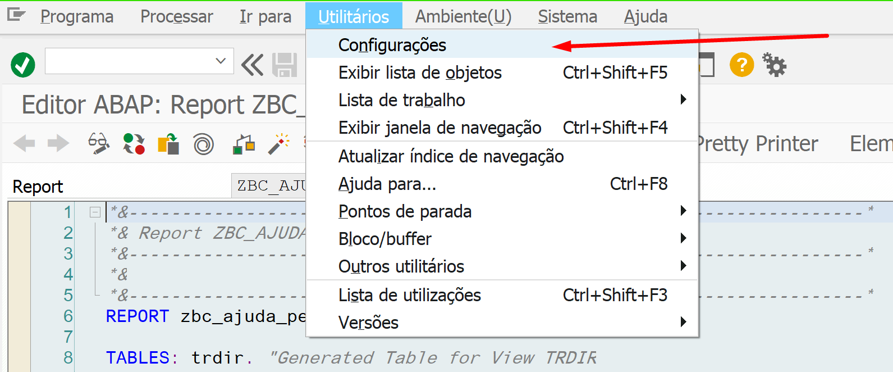
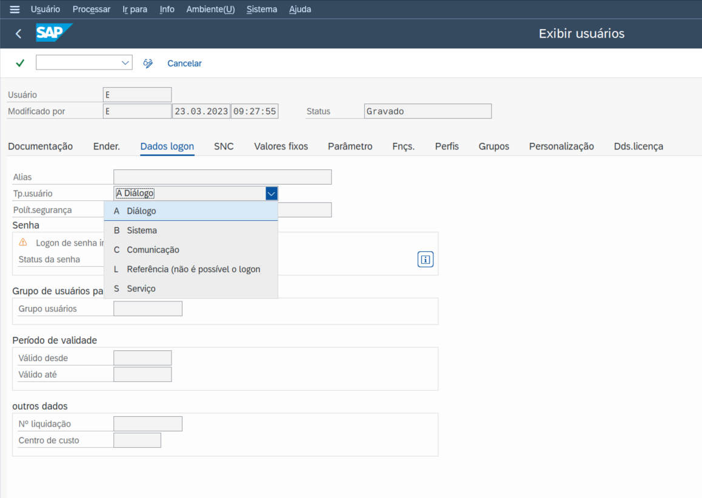
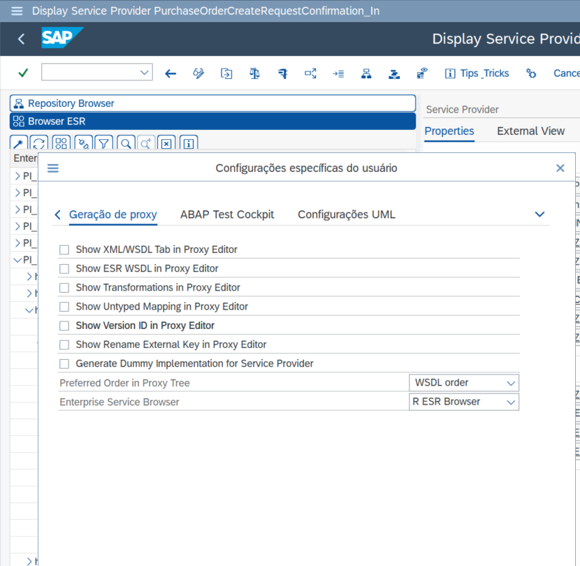

# External Debug / SPROXY Config

~~eu sempre me esqueço das configurações para debug externo e tambem update task, enfim, vou salvar o que Murilo me mostrou para deixar de perguntar 2x vezes por mês a mesma coisa.~~

Existem configurações diferentes para itens diferentes. Um deles para `debug externo` e outro para `update task`. De bonus, tambem vou colocar as config da transação de `SPROXY` ~~que tambem eu sempre esqueço e fico perguntado para o Murilo~~.

## Debug External

Com o código fonte aberto (pela transação `SE38` por exemplo), acessar o menu **Utilitarios > Configurações**.

A tela de configurações abaixo será exibida. Para a o objetivo, é preciso acessar **Editor ABAP > Depuração**. Marcar a opção **Usuário** e informar no campo o usuário que chamará o que SAP externamente, neste caso, `S-PIDI1`, uu seja, o usuário que está configurado no outro sistema.

Após preencher essa informações, basta confirmar no botão **✓ (ok)**.  

Depois de confirmar, basta colocar o `BREAK externo` (que é o que tem o bonequinho ☺).

Obs.: Mas, para isso funcionar, depende da permissão desse usuário externo. Se ele for de `B - Sistema` acho que não faz o debug. Mas quando for colocar o break, o SAP te avisa. Então tem que pedir pra mudar o *TP.Usuário* do usuário pra fazer a depuração.

## Update Task

só marcar ese FLAG que já está ativo kkk 

depurar atualização 

Mas isso só funciona para funções em UPDATE TASK

um caso bom pra testar isso é fazer um pedido de compra.. 

vc faz ele debugando normal.. 

e epoius que dá F8.. passa um pouquinho e abre outra tela de DEBUG já nas funções de UPDATE TASK

]kkkk

## SPROXY config
Não menos importante, mas ~~como eu sempre esqueço e tenho que perguntar pro Murilo e nem sempre ele esta de bom humor~~ eu acho importante salvar essas opções para futuramente ter onde procurar essa info.

Acessar a transação `SPROXY` e ir ate o menu **Utilities > Settings**.

Nas opções abaixo, desmarcar todos os ~~piscos~~ flags e escolher as seguintes opções:
- Preferred Order in Proxy Tree: `WSDL order`
- Enterprise Service Browser: `R - ESR Browser`

Após preencher essa informações, basta confirmar no botão **✓ (ok)**.  

Ainda faltam algumas coisas, mas o doc sera atualizado ~~quando eu descobrir o que pode ser~~ em breve.